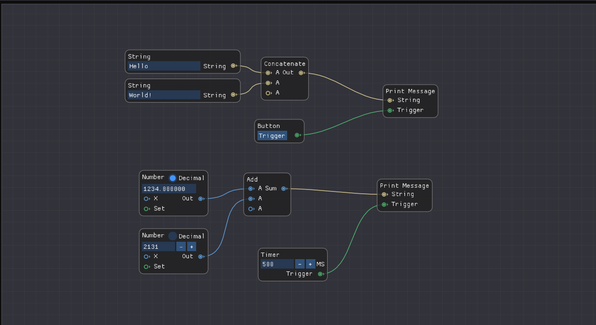

<h1 align="center">TCPCafe</h1>
<p align="center">
  <i>Test TCP connections faster and better!</i>
  <br/><br/>
  
  <br/><br/>
  
</p>

## Building
### Generators
- Tested Compilers: MinGW
- MSVC: Known bug that prevents BeginCombo's from working correctly

### CMake
Inside of /TCPCafe
```
mkdir build
cd build
cmake ..
cmake --build .
./TCPCafe.exe
```
